# [📈 Live Status](https://liquid369.wtf): <!--live status--> **🟧 Partial outage**

This repository contains the open-source uptime monitor and status page for [Liquid369](https://liquid369.wtf), powered by [Upptime](https://github.com/upptime/upptime).

With [Upptime](https://upptime.js.org), you can get your own unlimited and free uptime monitor and status page, powered entirely by a GitHub repository. We use [Issues](https://github.com/Liquid369/FlitsUptime/issues) as incident reports, [Actions](https://github.com/Liquid369/FlitsUptime/actions) as uptime monitors, and [Pages](https://liquid369.wtf) for the status page.

<!--start: status pages-->
<!-- This summary is generated by Upptime (https://github.com/upptime/upptime) -->
<!-- Do not edit this manually, your changes will be overwritten -->
<!-- prettier-ignore -->
| URL | Status | History | Response Time | Uptime |
| --- | ------ | ------- | ------------- | ------ |
|  [FLS](https://fls.flitswallet.app/api) | 🟩 Up | [fls.yml](https://github.com/Liquid369/FlitsUptime/commits/HEAD/history/fls.yml) | 

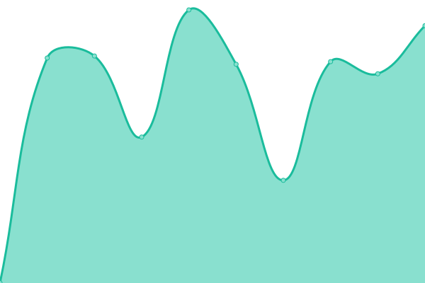 1150ms
     
 | 

<a href="https://liquid369.wtf/history/fls">100.00%</a>
    

|  [KTS](https://kts.flitswallet.app/api) | 🟩 Up | [kts.yml](https://github.com/Liquid369/FlitsUptime/commits/HEAD/history/kts.yml) | 

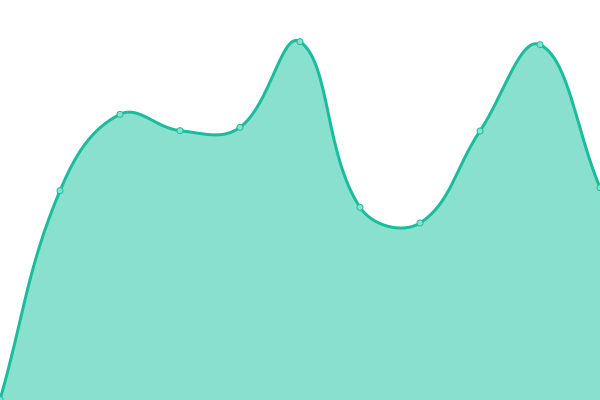 992ms
     
 | 

<a href="https://liquid369.wtf/history/kts">100.00%</a>
    

|  [DOGEC](https://dogec.flitswallet.app/api) | 🟩 Up | [dogec.yml](https://github.com/Liquid369/FlitsUptime/commits/HEAD/history/dogec.yml) | 

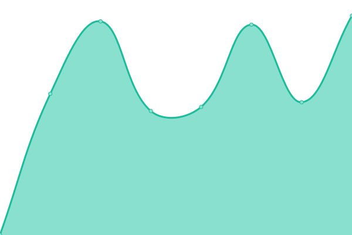 960ms
     
 | 

<a href="https://liquid369.wtf/history/dogec">100.00%</a>
    

|  [SCC](https://scc.flitswallet.app/api) | 🟩 Up | [scc.yml](https://github.com/Liquid369/FlitsUptime/commits/HEAD/history/scc.yml) | 

 913ms
     
 | 

<a href="https://liquid369.wtf/history/scc">100.00%</a>
    

|  [XP](https://xp.flitswallet.app/api) | 🟩 Up | [xp.yml](https://github.com/Liquid369/FlitsUptime/commits/HEAD/history/xp.yml) | 

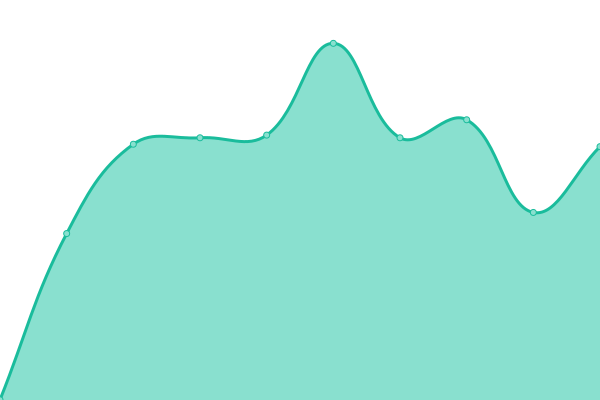 1014ms
     
 | 

<a href="https://liquid369.wtf/history/xp">100.00%</a>
    

|  [Jackpot](https://777.flitswallet.app/api) | 🟩 Up | [jackpot.yml](https://github.com/Liquid369/FlitsUptime/commits/HEAD/history/jackpot.yml) | 

 887ms
     
 | 

<a href="https://liquid369.wtf/history/jackpot">100.00%</a>
    

|  [TRTT](https://trtt.flitswallet.app/api) | 🟩 Up | [trtt.yml](https://github.com/Liquid369/FlitsUptime/commits/HEAD/history/trtt.yml) | 

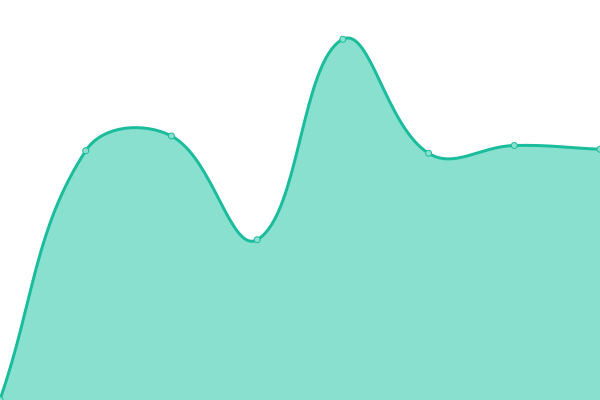 877ms
     
 | 

<a href="https://liquid369.wtf/history/trtt">100.00%</a>
    

|  [EZPAY](https://ezpay.flitswallet.app/api) | 🟩 Up | [ezpay.yml](https://github.com/Liquid369/FlitsUptime/commits/HEAD/history/ezpay.yml) | 

 940ms
     
 | 

<a href="https://liquid369.wtf/history/ezpay">100.00%</a>
    

|  [EGG](https://egg.flitswallet.app/api) | 🟩 Up | [egg.yml](https://github.com/Liquid369/FlitsUptime/commits/HEAD/history/egg.yml) | 

 901ms
     
 | 

<a href="https://liquid369.wtf/history/egg">100.00%</a>
    

|  [CFL](https://cfl.flitswallet.app/api) | 🟩 Up | [cfl.yml](https://github.com/Liquid369/FlitsUptime/commits/HEAD/history/cfl.yml) | 

 892ms
     
 | 

<a href="https://liquid369.wtf/history/cfl">100.00%</a>
    

|  [CSPN](https://cspn.flitswallet.app/api) | 🟩 Up | [cspn.yml](https://github.com/Liquid369/FlitsUptime/commits/HEAD/history/cspn.yml) | 

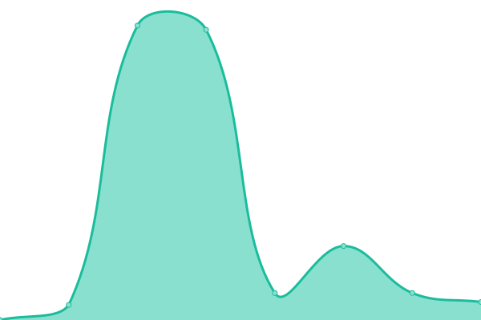 2716ms
     
 | 

<a href="https://liquid369.wtf/history/cspn">100.00%</a>
    

|  [OWO](https://owo.flitswallet.app/api) | 🟩 Up | [owo.yml](https://github.com/Liquid369/FlitsUptime/commits/HEAD/history/owo.yml) | 

 890ms
     
 | 

<a href="https://liquid369.wtf/history/owo">100.00%</a>
    

|  [SSS](https://sss.flitswallet.app/api) | 🟩 Up | [sss.yml](https://github.com/Liquid369/FlitsUptime/commits/HEAD/history/sss.yml) | 

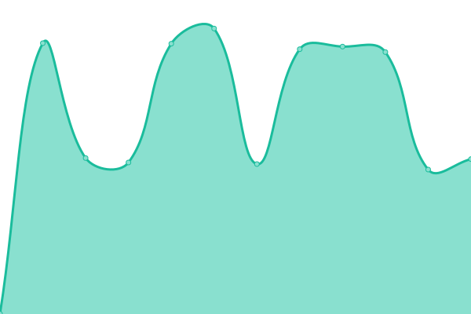 891ms
     
 | 

<a href="https://liquid369.wtf/history/sss">100.00%</a>
    

|  [ZNZ](https://znz.flitswallet.app/api) | 🟩 Up | [znz.yml](https://github.com/Liquid369/FlitsUptime/commits/HEAD/history/znz.yml) | 

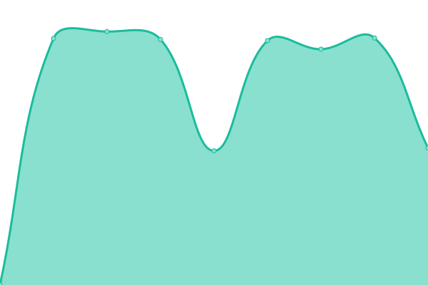 863ms
     
 | 

<a href="https://liquid369.wtf/history/znz">100.00%</a>
    

|  [AZR](https://azr.flitswallet.app/api) | 🟩 Up | [azr.yml](https://github.com/Liquid369/FlitsUptime/commits/HEAD/history/azr.yml) | 

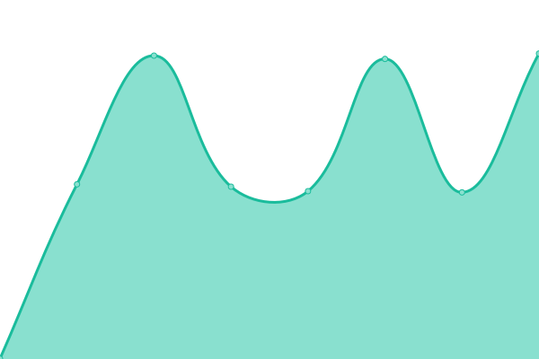 864ms
     
 | 

<a href="https://liquid369.wtf/history/azr">100.00%</a>
    

|  [MODIC](https://modic.flitswallet.app/api) | 🟩 Up | [modic.yml](https://github.com/Liquid369/FlitsUptime/commits/HEAD/history/modic.yml) | 

 926ms
     
 | 

<a href="https://liquid369.wtf/history/modic">100.00%</a>
    

|  [DMS](https://dms.flitswallet.app/api) | 🟩 Up | [dms.yml](https://github.com/Liquid369/FlitsUptime/commits/HEAD/history/dms.yml) | 

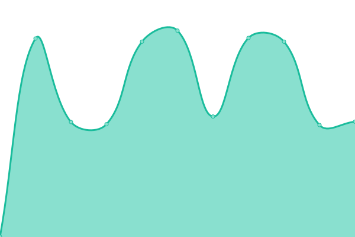 882ms
     
 | 

<a href="https://liquid369.wtf/history/dms">100.00%</a>
    

|  [DYN](https://dyn.flitswallet.app/api) | 🟩 Up | [dyn.yml](https://github.com/Liquid369/FlitsUptime/commits/HEAD/history/dyn.yml) | 

 860ms
     
 | 

<a href="https://liquid369.wtf/history/dyn">100.00%</a>
    

|  [ERS](https://ers.flitswallet.app/api) | 🟩 Up | [ers.yml](https://github.com/Liquid369/FlitsUptime/commits/HEAD/history/ers.yml) | 

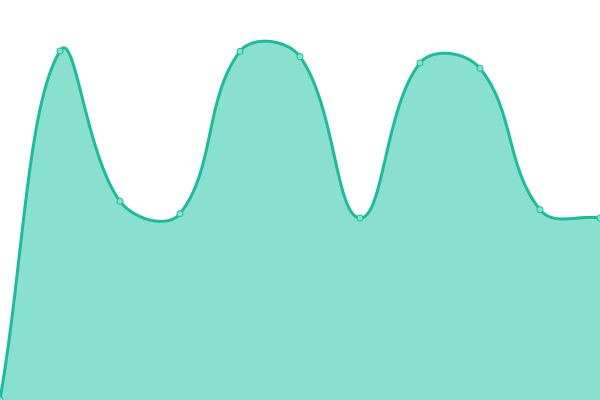 878ms
     
 | 

<a href="https://liquid369.wtf/history/ers">100.00%</a>
    

|  [ESBC](https://esbc.flitswallet.app/api) | 🟩 Up | [esbc.yml](https://github.com/Liquid369/FlitsUptime/commits/HEAD/history/esbc.yml) | 

 880ms
     
 | 

<a href="https://liquid369.wtf/history/esbc">100.00%</a>
    

|  [GTC](https://gtc.flitswallet.app/api) | 🟩 Up | [gtc.yml](https://github.com/Liquid369/FlitsUptime/commits/HEAD/history/gtc.yml) | 

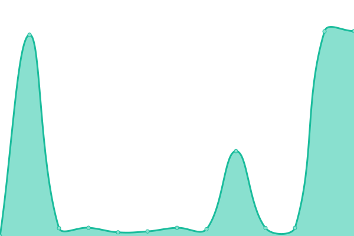 2017ms
     
 | 

<a href="https://liquid369.wtf/history/gtc">99.61%</a>
    

|  [TELOS](https://telos.flitswallet.app/api) | 🟩 Up | [telos.yml](https://github.com/Liquid369/FlitsUptime/commits/HEAD/history/telos.yml) | 

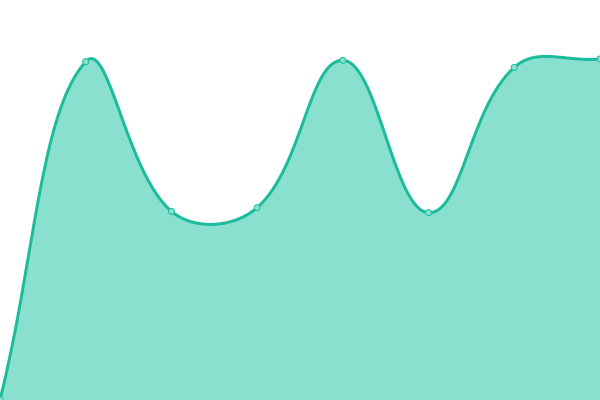 868ms
     
 | 

<a href="https://liquid369.wtf/history/telos">100.00%</a>
    

|  [XSCR](https://xscr.flitswallet.app/api) | 🟩 Up | [xscr.yml](https://github.com/Liquid369/FlitsUptime/commits/HEAD/history/xscr.yml) | 

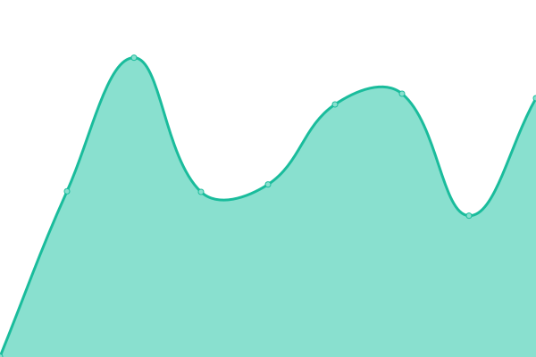 872ms
     
 | 

<a href="https://liquid369.wtf/history/xscr">100.00%</a>
    

|  [SAPP](https://sapp.flitswallet.app/api) | 🟩 Up | [sapp.yml](https://github.com/Liquid369/FlitsUptime/commits/HEAD/history/sapp.yml) | 

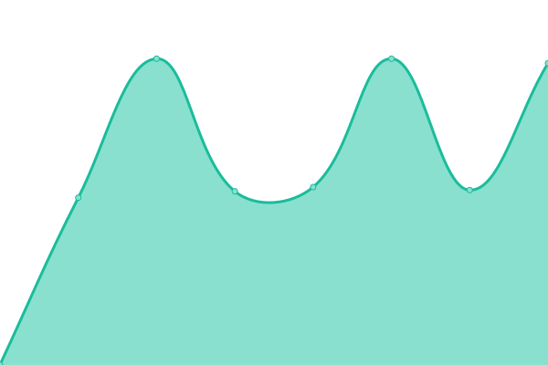 959ms
     
 | 

<a href="https://liquid369.wtf/history/sapp">100.00%</a>
    

|  [APR](https://apr.flitswallet.app/api) | 🟩 Up | [apr.yml](https://github.com/Liquid369/FlitsUptime/commits/HEAD/history/apr.yml) | 

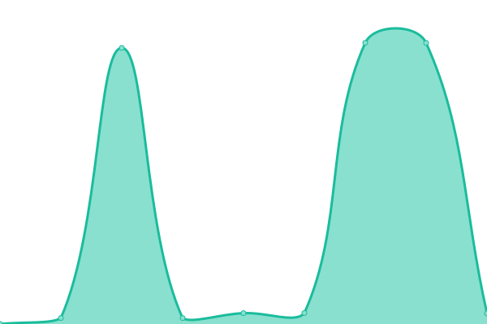 25857ms
     
 | 

<a href="https://liquid369.wtf/history/apr">100.00%</a>
    

|  [AXEL](https://axel.flitswallet.app/api) | 🟩 Up | [axel.yml](https://github.com/Liquid369/FlitsUptime/commits/HEAD/history/axel.yml) | 

 874ms
     
 | 

<a href="https://liquid369.wtf/history/axel">100.00%</a>
    

|  [CTSC](https://ctsc.flitswallet.app/api) | 🟩 Up | [ctsc.yml](https://github.com/Liquid369/FlitsUptime/commits/HEAD/history/ctsc.yml) | 

 855ms
     
 | 

<a href="https://liquid369.wtf/history/ctsc">99.63%</a>
    

|  [ESK](https://esk.flitswallet.app/api) | 🟩 Up | [esk.yml](https://github.com/Liquid369/FlitsUptime/commits/HEAD/history/esk.yml) | 

 866ms
     
 | 

<a href="https://liquid369.wtf/history/esk">100.00%</a>
    

|  [KYD](https://kyd.flitswallet.app/api) | 🟩 Up | [kyd.yml](https://github.com/Liquid369/FlitsUptime/commits/HEAD/history/kyd.yml) | 

 861ms
     
 | 

<a href="https://liquid369.wtf/history/kyd">100.00%</a>
    

|  [NBX](https://nbx.flitswallet.app/api) | 🟩 Up | [nbx.yml](https://github.com/Liquid369/FlitsUptime/commits/HEAD/history/nbx.yml) | 

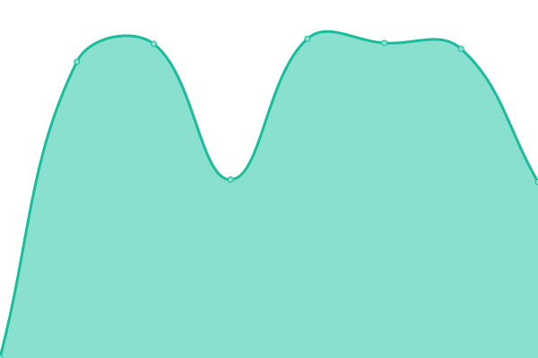 867ms
     
 | 

<a href="https://liquid369.wtf/history/nbx">100.00%</a>
    

|  [SOVE](https://sove.flitswallet.app/api) | 🟩 Up | [sove.yml](https://github.com/Liquid369/FlitsUptime/commits/HEAD/history/sove.yml) | 

 877ms
     
 | 

<a href="https://liquid369.wtf/history/sove">100.00%</a>
    

|  [TWINS](https://twins.flitswallet.app/api) | 🟩 Up | [twins.yml](https://github.com/Liquid369/FlitsUptime/commits/HEAD/history/twins.yml) | 

 868ms
     
 | 

<a href="https://liquid369.wtf/history/twins">100.00%</a>
    

|  [XGS](https://xgs.flitswallet.app/api) | 🟥 Down | [xgs.yml](https://github.com/Liquid369/FlitsUptime/commits/HEAD/history/xgs.yml) | 

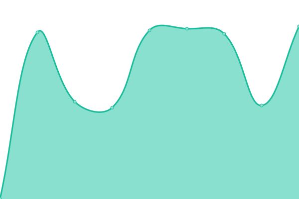 3110ms
     
 | 

<a href="https://liquid369.wtf/history/xgs">64.83%</a>
    

|  [XLQ](https://xlq.flitswallet.app/api) | 🟩 Up | [xlq.yml](https://github.com/Liquid369/FlitsUptime/commits/HEAD/history/xlq.yml) | 

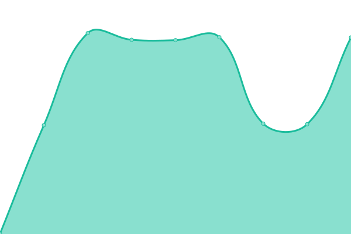 867ms
     
 | 

<a href="https://liquid369.wtf/history/xlq">100.00%</a>
    

|  [XSN](https://xsn.flitswallet.app/api) | 🟩 Up | [xsn.yml](https://github.com/Liquid369/FlitsUptime/commits/HEAD/history/xsn.yml) | 

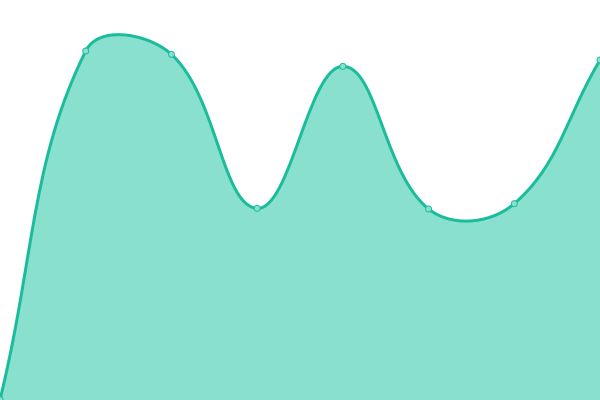 877ms
     
 | 

<a href="https://liquid369.wtf/history/xsn">100.00%</a>
    

|  [ZDX](https://zdx.flitswallet.app/api) | 🟩 Up | [zdx.yml](https://github.com/Liquid369/FlitsUptime/commits/HEAD/history/zdx.yml) | 

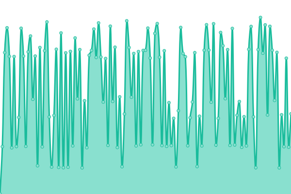 875ms
     
 | 

<a href="https://liquid369.wtf/history/zdx">100.00%</a>
    

|  [FUNC](https://func.flitswallet.app/api) | 🟩 Up | [func.yml](https://github.com/Liquid369/FlitsUptime/commits/HEAD/history/func.yml) | 

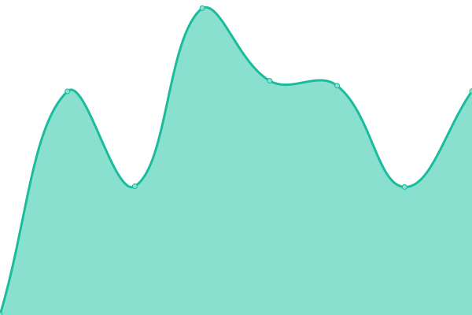 869ms
     
 | 

<a href="https://liquid369.wtf/history/func">100.00%</a>
    

|  [MIDAS](https://midas.flitswallet.app/api) | 🟩 Up | [midas.yml](https://github.com/Liquid369/FlitsUptime/commits/HEAD/history/midas.yml) | 

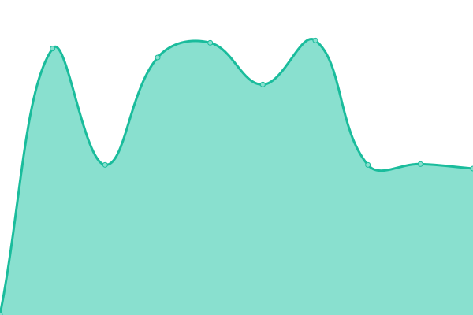 824ms
     
 | 

<a href="https://liquid369.wtf/history/midas">99.31%</a>
    

|  [ABET](https://abet.flitswallet.app/api) | 🟩 Up | [abet.yml](https://github.com/Liquid369/FlitsUptime/commits/HEAD/history/abet.yml) | 

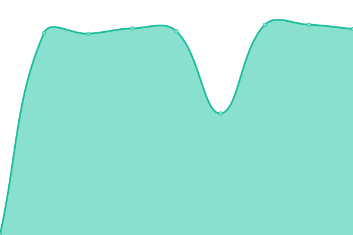 887ms
     
 | 

<a href="https://liquid369.wtf/history/abet">100.00%</a>
    

|  [BARE](https://bare.flitswallet.app/api) | 🟩 Up | [bare.yml](https://github.com/Liquid369/FlitsUptime/commits/HEAD/history/bare.yml) | 

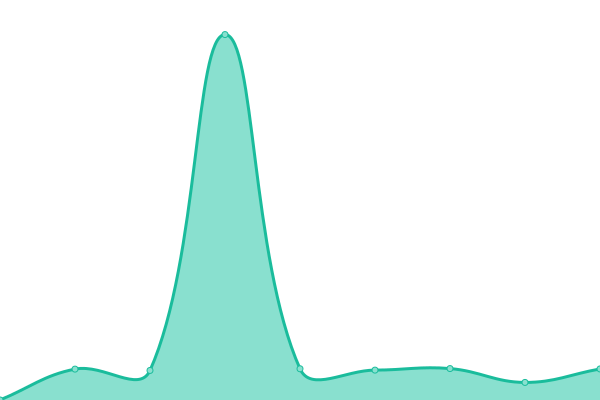 859ms
     
 | 

<a href="https://liquid369.wtf/history/bare">100.00%</a>
    

|  [BIR](https://bir.flitswallet.app/api) | 🟩 Up | [bir.yml](https://github.com/Liquid369/FlitsUptime/commits/HEAD/history/bir.yml) | 

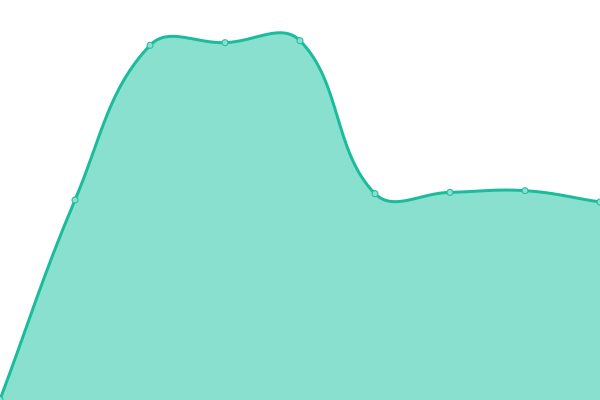 858ms
     
 | 

<a href="https://liquid369.wtf/history/bir">99.28%</a>
    

|  [BLTG](https://bltg.flitswallet.app/api) | 🟩 Up | [bltg.yml](https://github.com/Liquid369/FlitsUptime/commits/HEAD/history/bltg.yml) | 

 869ms
     
 | 

<a href="https://liquid369.wtf/history/bltg">100.00%</a>
    

|  [CARI](https://cari.flitswallet.app/api) | 🟩 Up | [cari.yml](https://github.com/Liquid369/FlitsUptime/commits/HEAD/history/cari.yml) | 

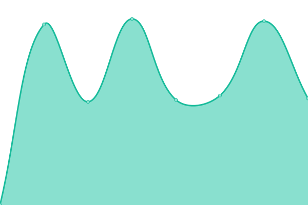 867ms
     
 | 

<a href="https://liquid369.wtf/history/cari">100.00%</a>
    

|  [CCY](https://ccy.flitswallet.app/api) | 🟩 Up | [ccy.yml](https://github.com/Liquid369/FlitsUptime/commits/HEAD/history/ccy.yml) | 

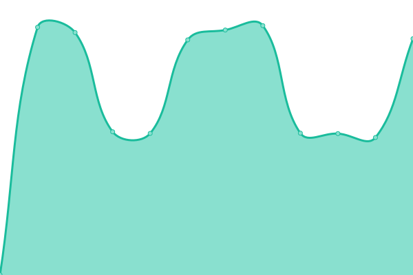 982ms
     
 | 

<a href="https://liquid369.wtf/history/ccy">99.50%</a>
    

|  [DEV](https://dev.flitswallet.app/api) | 🟩 Up | [dev.yml](https://github.com/Liquid369/FlitsUptime/commits/HEAD/history/dev.yml) | 

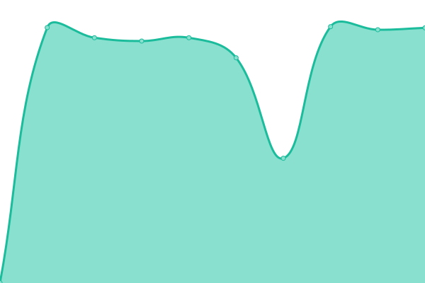 855ms
     
 | 

<a href="https://liquid369.wtf/history/dev">100.00%</a>
    

|  [ESSX](https://essx.flitswallet.app/api) | 🟩 Up | [essx.yml](https://github.com/Liquid369/FlitsUptime/commits/HEAD/history/essx.yml) | 

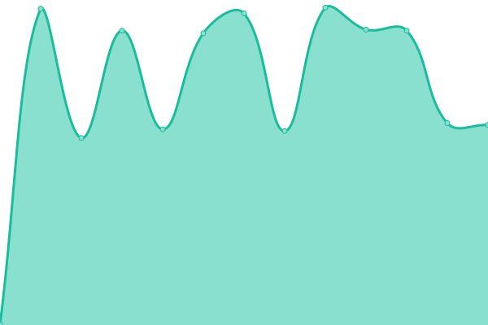 881ms
     
 | 

<a href="https://liquid369.wtf/history/essx">99.50%</a>
    

|  [FDR](https://fdr.flitswallet.app/api) | 🟩 Up | [fdr.yml](https://github.com/Liquid369/FlitsUptime/commits/HEAD/history/fdr.yml) | 

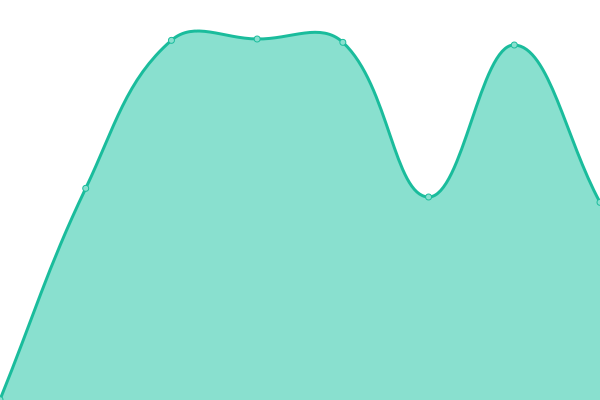 863ms
     
 | 

<a href="https://liquid369.wtf/history/fdr">100.00%</a>
    

|  [FLN](https://fln.flitswallet.app/api) | 🟩 Up | [fln.yml](https://github.com/Liquid369/FlitsUptime/commits/HEAD/history/fln.yml) | 

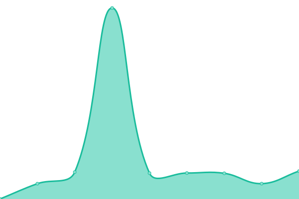 909ms
     
 | 

<a href="https://liquid369.wtf/history/fln">99.19%</a>
    

|  [FYD](https://fyd.flitswallet.app/api) | 🟩 Up | [fyd.yml](https://github.com/Liquid369/FlitsUptime/commits/HEAD/history/fyd.yml) | 

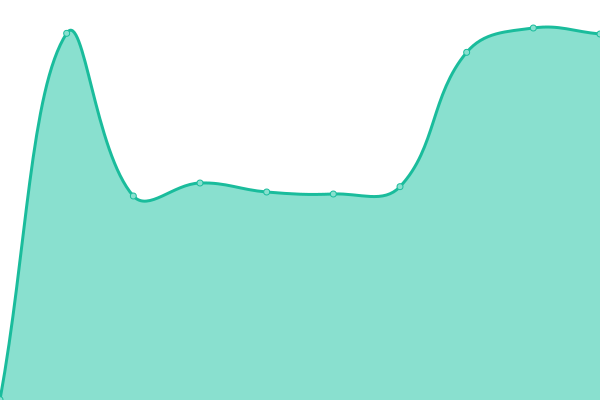 894ms
     
 | 

<a href="https://liquid369.wtf/history/fyd">99.51%</a>
    

|  [GBX](https://gbx.flitswallet.app/api) | 🟩 Up | [gbx.yml](https://github.com/Liquid369/FlitsUptime/commits/HEAD/history/gbx.yml) | 

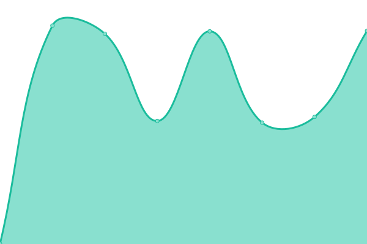 993ms
     
 | 

<a href="https://liquid369.wtf/history/gbx">99.20%</a>
    

|  [IDX](https://idx.flitswallet.app/api) | 🟩 Up | [idx.yml](https://github.com/Liquid369/FlitsUptime/commits/HEAD/history/idx.yml) | 

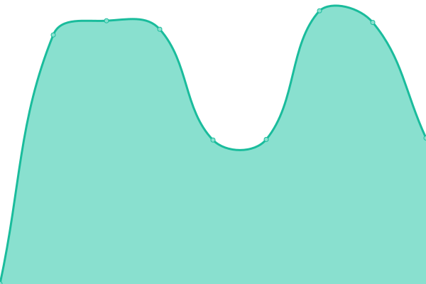 868ms
     
 | 

<a href="https://liquid369.wtf/history/idx">100.00%</a>
    

|  [LABX](https://labx.flitswallet.app/api) | 🟩 Up | [labx.yml](https://github.com/Liquid369/FlitsUptime/commits/HEAD/history/labx.yml) | 

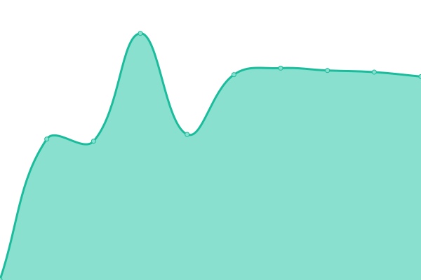 860ms
     
 | 

<a href="https://liquid369.wtf/history/labx">100.00%</a>
    

|  [MERGE](https://merge.flitswallet.app/api) | 🟩 Up | [merge.yml](https://github.com/Liquid369/FlitsUptime/commits/HEAD/history/merge.yml) | 

 3847ms
     
 | 

<a href="https://liquid369.wtf/history/merge">86.18%</a>
    

|  [QUOT](https://quot.flitswallet.app/api) | 🟩 Up | [quot.yml](https://github.com/Liquid369/FlitsUptime/commits/HEAD/history/quot.yml) | 

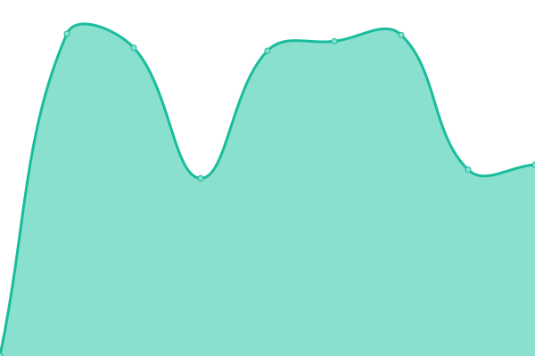 863ms
     
 | 

<a href="https://liquid369.wtf/history/quot">100.00%</a>
    

|  [MARC](https://marc.flitswallet.app/api) | 🟩 Up | [marc.yml](https://github.com/Liquid369/FlitsUptime/commits/HEAD/history/marc.yml) | 

 5499ms
     
 | 

<a href="https://liquid369.wtf/history/marc">77.58%</a>
    

|  [ULG](https://ulg.flitswallet.app/api) | 🟩 Up | [ulg.yml](https://github.com/Liquid369/FlitsUptime/commits/HEAD/history/ulg.yml) | 

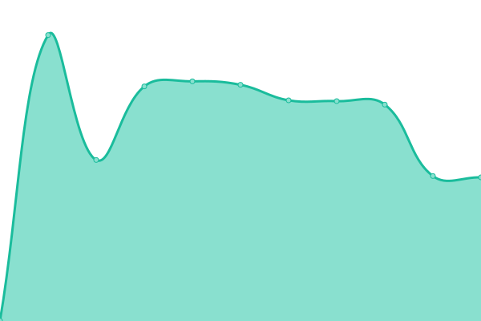 889ms
     
 | 

<a href="https://liquid369.wtf/history/ulg">99.51%</a>
    

|  [KYAN](https://kyan.flitswallet.app/api) | 🟩 Up | [kyan.yml](https://github.com/Liquid369/FlitsUptime/commits/HEAD/history/kyan.yml) | 

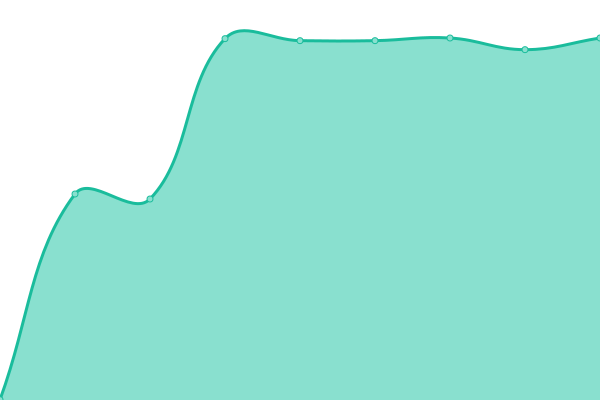 943ms
     
 | 

<a href="https://liquid369.wtf/history/kyan">100.00%</a>
    

|  [LYRA](https://lyra.flitswallet.app/api) | 🟩 Up | [lyra.yml](https://github.com/Liquid369/FlitsUptime/commits/HEAD/history/lyra.yml) | 

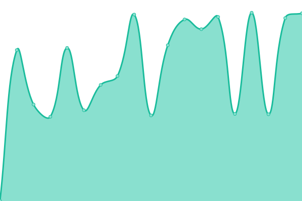 2681ms
     
 | 

<a href="https://liquid369.wtf/history/lyra">96.66%</a>
    

|  [EPG](https://epg.flitswallet.app/api) | 🟩 Up | [epg.yml](https://github.com/Liquid369/FlitsUptime/commits/HEAD/history/epg.yml) | 

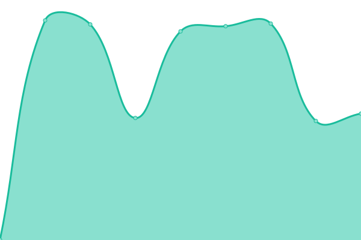 864ms
     
 | 

<a href="https://liquid369.wtf/history/epg">100.00%</a>
    

|  [REMIT](https://remit.flitswallet.app/api) | 🟩 Up | [remit.yml](https://github.com/Liquid369/FlitsUptime/commits/HEAD/history/remit.yml) | 

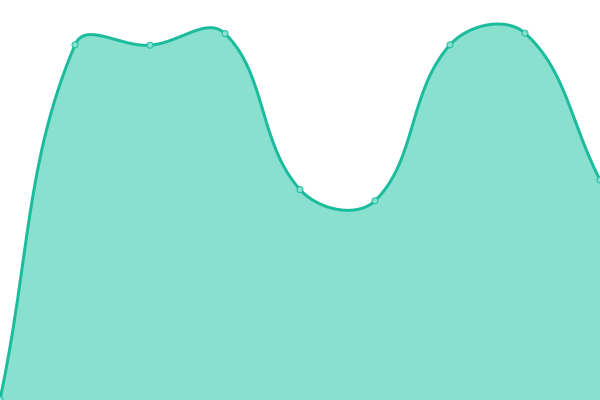 857ms
     
 | 

<a href="https://liquid369.wtf/history/remit">100.00%</a>
    

|  [GIC](https://gic.flitswallet.app/api) | 🟩 Up | [gic.yml](https://github.com/Liquid369/FlitsUptime/commits/HEAD/history/gic.yml) | 

 878ms
     
 | 

<a href="https://liquid369.wtf/history/gic">100.00%</a>
    

|  [GAU](https://gau.flitswallet.app/api) | 🟩 Up | [gau.yml](https://github.com/Liquid369/FlitsUptime/commits/HEAD/history/gau.yml) | 

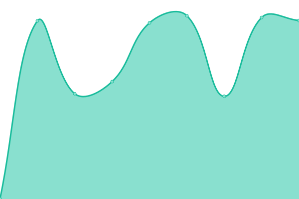 867ms
     
 | 

<a href="https://liquid369.wtf/history/gau">100.00%</a>
    

|  [NS](https://ns.flitswallet.app/api) | 🟩 Up | [ns.yml](https://github.com/Liquid369/FlitsUptime/commits/HEAD/history/ns.yml) | 

 890ms
     
 | 

<a href="https://liquid369.wtf/history/ns">100.00%</a>
    

|  [PFZER](https://pfzer.flitswallet.app/api) | 🟩 Up | [pfzer.yml](https://github.com/Liquid369/FlitsUptime/commits/HEAD/history/pfzer.yml) | 

 859ms
     
 | 

<a href="https://liquid369.wtf/history/pfzer">100.00%</a>
    

|  [PHR](https://phr.flitswallet.app/api) | 🟩 Up | [phr.yml](https://github.com/Liquid369/FlitsUptime/commits/HEAD/history/phr.yml) | 

 891ms
     
 | 

<a href="https://liquid369.wtf/history/phr">100.00%</a>
    

|  [PIVX](https://pivx.flitswallet.app/api) | 🟩 Up | [pivx.yml](https://github.com/Liquid369/FlitsUptime/commits/HEAD/history/pivx.yml) | 

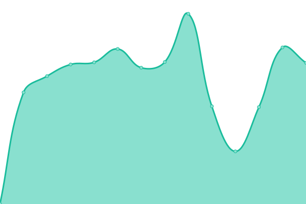 1053ms
     
 | 

<a href="https://liquid369.wtf/history/pivx">100.00%</a>
    

|  [UCR](https://ucr.flitswallet.app/api) | 🟩 Up | [ucr.yml](https://github.com/Liquid369/FlitsUptime/commits/HEAD/history/ucr.yml) | 

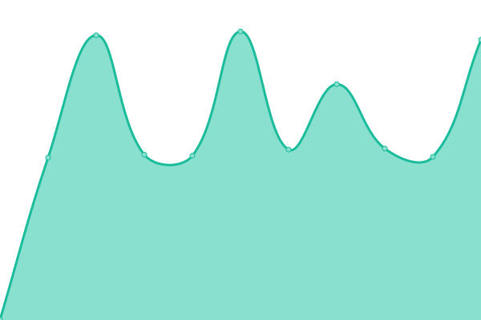 869ms
     
 | 

<a href="https://liquid369.wtf/history/ucr">100.00%</a>
    

|  [SMNC](https://smnc.flitswallet.app/api) | 🟩 Up | [smnc.yml](https://github.com/Liquid369/FlitsUptime/commits/HEAD/history/smnc.yml) | 

 860ms
     
 | 

<a href="https://liquid369.wtf/history/smnc">100.00%</a>
    

|  [PNY](https://pny.flitswallet.app/api) | 🟩 Up | [pny.yml](https://github.com/Liquid369/FlitsUptime/commits/HEAD/history/pny.yml) | 

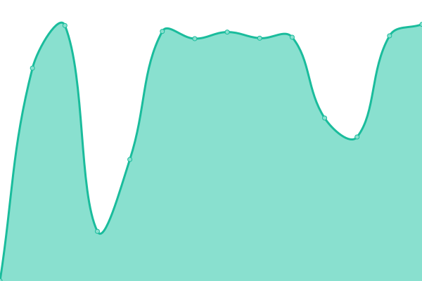 901ms
     
 | 

<a href="https://liquid369.wtf/history/pny">100.00%</a>
    

<!--end: status pages-->

[**Visit our status website →**](https://liquid369.wtf)

## 📄 License

- Powered by: [Upptime](https://github.com/upptime/upptime)
- Code: [MIT](./LICENSE) © [Liquid369](https://liquid369.wtf)
- Data in the `./history` directory: [Open Database License](https://opendatacommons.org/licenses/odbl/1-0/)
