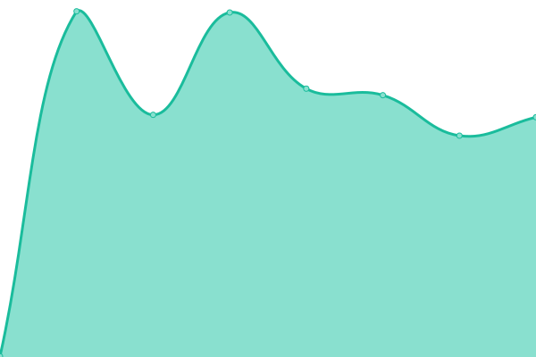

# [📈 Live Status](https://liquid369.wtf): <!--live status--> **🟧 Partial outage**

This repository contains the open-source uptime monitor and status page for [Liquid369](https://liquid369.wtf), powered by [Upptime](https://github.com/upptime/upptime).

With [Upptime](https://upptime.js.org), you can get your own unlimited and free uptime monitor and status page, powered entirely by a GitHub repository. We use [Issues](https://github.com/Liquid369/FlitsUptime/issues) as incident reports, [Actions](https://github.com/Liquid369/FlitsUptime/actions) as uptime monitors, and [Pages](https://liquid369.wtf) for the status page.

<!--start: status pages-->
<!-- This summary is generated by Upptime (https://github.com/upptime/upptime) -->
<!-- Do not edit this manually, your changes will be overwritten -->
<!-- prettier-ignore -->
| URL | Status | History | Response Time | Uptime |
| --- | ------ | ------- | ------------- | ------ |
|  [FLS](https://fls.flitswallet.app/api) | 🟩 Up | [fls.yml](https://github.com/Liquid369/FlitsUptime/commits/HEAD/history/fls.yml) | 

 763ms
     
 | 

<a href="https://liquid369.wtf/history/fls">100.00%</a>
    

|  [KTS](https://kts.flitswallet.app/api) | 🟩 Up | [kts.yml](https://github.com/Liquid369/FlitsUptime/commits/HEAD/history/kts.yml) | 

 733ms
     
 | 

<a href="https://liquid369.wtf/history/kts">100.00%</a>
    

|  [DOGEC](https://dogec.flitswallet.app/api) | 🟩 Up | [dogec.yml](https://github.com/Liquid369/FlitsUptime/commits/HEAD/history/dogec.yml) | 

 779ms
     
 | 

<a href="https://liquid369.wtf/history/dogec">100.00%</a>
    

|  [SCC](https://scc.flitswallet.app/api) | 🟩 Up | [scc.yml](https://github.com/Liquid369/FlitsUptime/commits/HEAD/history/scc.yml) | 

 1565ms
     
 | 

<a href="https://liquid369.wtf/history/scc">100.00%</a>
    

|  [Jackpot](https://777.flitswallet.app/api) | 🟩 Up | [jackpot.yml](https://github.com/Liquid369/FlitsUptime/commits/HEAD/history/jackpot.yml) | 

 691ms
     
 | 

<a href="https://liquid369.wtf/history/jackpot">100.00%</a>
    

|  [TRTT](https://trtt.flitswallet.app/api) | 🟩 Up | [trtt.yml](https://github.com/Liquid369/FlitsUptime/commits/HEAD/history/trtt.yml) | 

 669ms
     
 | 

<a href="https://liquid369.wtf/history/trtt">100.00%</a>
    

|  [CFL](https://cfl.flitswallet.app/api) | 🟩 Up | [cfl.yml](https://github.com/Liquid369/FlitsUptime/commits/HEAD/history/cfl.yml) | 

 682ms
     
 | 

<a href="https://liquid369.wtf/history/cfl">100.00%</a>
    

|  [OWO](https://owo.flitswallet.app/api) | 🟩 Up | [owo.yml](https://github.com/Liquid369/FlitsUptime/commits/HEAD/history/owo.yml) | 

 658ms
     
 | 

<a href="https://liquid369.wtf/history/owo">100.00%</a>
    

|  [SSS](https://sss.flitswallet.app/api) | 🟩 Up | [sss.yml](https://github.com/Liquid369/FlitsUptime/commits/HEAD/history/sss.yml) | 

 732ms
     
 | 

<a href="https://liquid369.wtf/history/sss">100.00%</a>
    

|  [ZNZ](https://znz.flitswallet.app/api) | 🟩 Up | [znz.yml](https://github.com/Liquid369/FlitsUptime/commits/HEAD/history/znz.yml) | 

 670ms
     
 | 

<a href="https://liquid369.wtf/history/znz">100.00%</a>
    

|  [AZR](https://azr.flitswallet.app/api) | 🟩 Up | [azr.yml](https://github.com/Liquid369/FlitsUptime/commits/HEAD/history/azr.yml) | 

 672ms
     
 | 

<a href="https://liquid369.wtf/history/azr">100.00%</a>
    

|  [MOBIC](https://mobic.flitswallet.app/api) | 🟩 Up | [mobic.yml](https://github.com/Liquid369/FlitsUptime/commits/HEAD/history/mobic.yml) | 

 4195ms
     
 | 

<a href="https://liquid369.wtf/history/mobic">100.00%</a>
    

|  [ERS](https://ers.flitswallet.app/api) | 🟩 Up | [ers.yml](https://github.com/Liquid369/FlitsUptime/commits/HEAD/history/ers.yml) | 

 753ms
     
 | 

<a href="https://liquid369.wtf/history/ers">100.00%</a>
    

|  [ESBC](https://esbc.flitswallet.app/api) | 🟩 Up | [esbc.yml](https://github.com/Liquid369/FlitsUptime/commits/HEAD/history/esbc.yml) | 

 733ms
     
 | 

<a href="https://liquid369.wtf/history/esbc">100.00%</a>
    

|  [GTC](https://gtc.flitswallet.app/api) | 🟩 Up | [gtc.yml](https://github.com/Liquid369/FlitsUptime/commits/HEAD/history/gtc.yml) | 

 619ms
     
 | 

<a href="https://liquid369.wtf/history/gtc">100.00%</a>
    

|  [TELOS](https://telos.flitswallet.app/api) | 🟥 Down | [telos.yml](https://github.com/Liquid369/FlitsUptime/commits/HEAD/history/telos.yml) | 

 533ms
     
 | 

<a href="https://liquid369.wtf/history/telos">0.00%</a>
    

|  [XSCR](https://xscr.flitswallet.app/api) | 🟩 Up | [xscr.yml](https://github.com/Liquid369/FlitsUptime/commits/HEAD/history/xscr.yml) | 

 649ms
     
 | 

<a href="https://liquid369.wtf/history/xscr">100.00%</a>
    

|  [SAPP](https://sapp.flitswallet.app/api) | 🟩 Up | [sapp.yml](https://github.com/Liquid369/FlitsUptime/commits/HEAD/history/sapp.yml) | 

 761ms
     
 | 

<a href="https://liquid369.wtf/history/sapp">100.00%</a>
    

|  [APR](https://apr.flitswallet.app/api) | 🟥 Down | [apr.yml](https://github.com/Liquid369/FlitsUptime/commits/HEAD/history/apr.yml) | 

 0ms
     
 | 

<a href="https://liquid369.wtf/history/apr">0.00%</a>
    

|  [ESK](https://esk.flitswallet.app/api) | 🟩 Up | [esk.yml](https://github.com/Liquid369/FlitsUptime/commits/HEAD/history/esk.yml) | 

 648ms
     
 | 

<a href="https://liquid369.wtf/history/esk">100.00%</a>
    

|  [KYD](https://kyd.flitswallet.app/api) | 🟥 Down | [kyd.yml](https://github.com/Liquid369/FlitsUptime/commits/HEAD/history/kyd.yml) | 

 0ms
     
 | 

<a href="https://liquid369.wtf/history/kyd">0.00%</a>
    

|  [SOVE](https://sove.flitswallet.app/api) | 🟩 Up | [sove.yml](https://github.com/Liquid369/FlitsUptime/commits/HEAD/history/sove.yml) | 

 751ms
     
 | 

<a href="https://liquid369.wtf/history/sove">100.00%</a>
    

|  [TWINS](https://twins.flitswallet.app/api) | 🟥 Down | [twins.yml](https://github.com/Liquid369/FlitsUptime/commits/HEAD/history/twins.yml) | 

 0ms
     
 | 

<a href="https://liquid369.wtf/history/twins">0.00%</a>
    

|  [XLQ](https://xlq.flitswallet.app/api) | 🟥 Down | [xlq.yml](https://github.com/Liquid369/FlitsUptime/commits/HEAD/history/xlq.yml) | 

 0ms
     
 | 

<a href="https://liquid369.wtf/history/xlq">0.00%</a>
    

|  [BIR](https://bir.flitswallet.app/api) | 🟩 Up | [bir.yml](https://github.com/Liquid369/FlitsUptime/commits/HEAD/history/bir.yml) | 

 610ms
     
 | 

<a href="https://liquid369.wtf/history/bir">100.00%</a>
    

|  [DEV](https://dev.flitswallet.app/api) | 🟩 Up | [dev.yml](https://github.com/Liquid369/FlitsUptime/commits/HEAD/history/dev.yml) | 

 1153ms
     
 | 

<a href="https://liquid369.wtf/history/dev">100.00%</a>
    

|  [ESSX](https://essx.flitswallet.app/api) | 🟩 Up | [essx.yml](https://github.com/Liquid369/FlitsUptime/commits/HEAD/history/essx.yml) | 

 617ms
     
 | 

<a href="https://liquid369.wtf/history/essx">100.00%</a>
    

|  [FDR](https://fdr.flitswallet.app/api) | 🟩 Up | [fdr.yml](https://github.com/Liquid369/FlitsUptime/commits/HEAD/history/fdr.yml) | 

 609ms
     
 | 

<a href="https://liquid369.wtf/history/fdr">100.00%</a>
    

|  [KYAN](https://kyan.flitswallet.app/api) | 🟩 Up | [kyan.yml](https://github.com/Liquid369/FlitsUptime/commits/HEAD/history/kyan.yml) | 

 632ms
     
 | 

<a href="https://liquid369.wtf/history/kyan">100.00%</a>
    

|  [PIVX](https://pivx.flitswallet.app/api) | 🟩 Up | [pivx.yml](https://github.com/Liquid369/FlitsUptime/commits/HEAD/history/pivx.yml) | 

 846ms
     
 | 

<a href="https://liquid369.wtf/history/pivx">100.00%</a>
    

|  [UCR](https://ucr.flitswallet.app/api) | 🟩 Up | [ucr.yml](https://github.com/Liquid369/FlitsUptime/commits/HEAD/history/ucr.yml) | 

 629ms
     
 | 

<a href="https://liquid369.wtf/history/ucr">100.00%</a>
    

|  [PNY](https://pny.flitswallet.app/api) | 🟩 Up | [pny.yml](https://github.com/Liquid369/FlitsUptime/commits/HEAD/history/pny.yml) | 

 612ms
     
 | 

<a href="https://liquid369.wtf/history/pny">100.00%</a>
    

|  [MERGE](https://merge.flitswallet.app/api) | 🟩 Up | [merge.yml](https://github.com/Liquid369/FlitsUptime/commits/HEAD/history/merge.yml) | 

 613ms
     
 | 

<a href="https://liquid369.wtf/history/merge">100.00%</a>
    

|  [MW](https://mw.flitswallet.app/api) | 🟩 Up | [mw.yml](https://github.com/Liquid369/FlitsUptime/commits/HEAD/history/mw.yml) | 

 624ms
     
 | 

<a href="https://liquid369.wtf/history/mw">100.00%</a>
    

|  [PWRB](https://pwrb.flitswallet.app/api) | 🟩 Up | [pwrb.yml](https://github.com/Liquid369/FlitsUptime/commits/HEAD/history/pwrb.yml) | 

 1107ms
     
 | 

<a href="https://liquid369.wtf/history/pwrb">100.00%</a>
    

<!--end: status pages-->

[**Visit our status website →**](https://liquid369.wtf)

## 📄 License

- Powered by: [Upptime](https://github.com/upptime/upptime)
- Code: [MIT](./LICENSE) © [Liquid369](https://liquid369.wtf)
- Data in the `./history` directory: [Open Database License](https://opendatacommons.org/licenses/odbl/1-0/)
